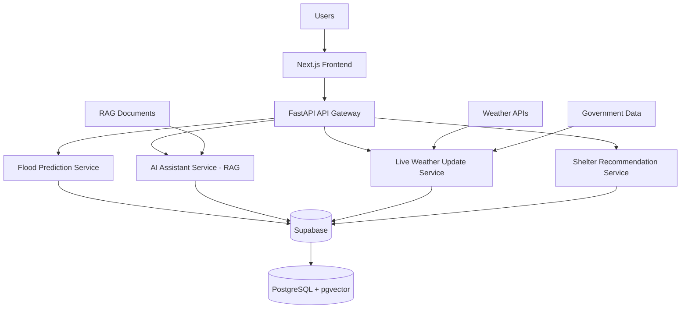

# 🌊 FloodGuard

> **An AI-Powered Real-Time Flood Response and Alert System**

[](#-license)
[](#-current-status)
[](#-target-system-architecture)
[](https://fastapi.tiangolo.com/)
[](https://nextjs.org/)

---

## 📖 Overview

**FloodGuard** is an AI-powered disaster management platform designed to address the critical need for real-time flood response and early warning systems. It combines Machine Learning-based flood risk prediction, live weather intelligence, smart shelter recommendations, and a Retrieval-Augmented Generation (RAG) AI assistant grounded in trusted government guidelines.

The platform follows a **Microservices Architecture (Approach 2)**, where each concern — prediction, AI assistance, weather monitoring, and shelter recommendation — is handled by an independent, scalable service orchestrated through a unified API Gateway.

> Built for researchers, disaster management professionals, and communities at risk of flooding — particularly across India.

---

## ✨ Features

| Icon | Feature | Description |
|------|---------|-------------|
| 🌊 | **Flood Risk Prediction** | ML models assess flood probability using rainfall, catchment, and historical data |
| 🤖 | **AI Assistant (RAG)** | Conversational assistant powered by LangChain + Gemini, grounded in NDMA/IMD/NDRF guidelines |
| 🌦️ | **Real-Time Weather Updates** | Live weather data ingestion and monitoring from external weather APIs |
| 🗺️ | **Interactive Flood Map** | Leaflet + OpenStreetMap visualisation of flood-risk zones and affected areas |
| 🏠 | **Shelter Recommendation** | Nearest verified safe shelters surfaced based on user location and risk level |
| 🚨 | **Emergency Alerts** | Proactive alert notifications triggered by flood risk thresholds |
| 📍 | **Safe Shelter Navigation** | Turn-by-turn guidance to the closest government-verified evacuation shelter |

---

## 🏗️ Target System Architecture

FloodGuard follows a microservices design. Each backend service is independently deployable and communicates through the FastAPI API Gateway. The diagram below illustrates the complete data flow.



### Service Responsibilities

| Service | Responsibility |
|---------|---------------|
| **API Gateway** | Central entry point; routes requests to downstream microservices |
| **Flood Prediction Service** | Runs ML inference to classify and score flood risk |
| **AI Assistant Service** | RAG pipeline — embeds queries, retrieves context, generates responses via Gemini |
| **Live Weather Update Service** | Fetches and normalises data from external weather APIs |
| **Shelter Recommendation Service** | Geo-queries Supabase to surface nearby verified shelters |

---

## 🛠️ Technology Stack

| Layer | Technology | Purpose |
|-------|------------|---------|
| **Frontend** | Next.js · TypeScript · Tailwind CSS | Responsive, type-safe user interface |
| **Backend** | FastAPI | High-performance async API Gateway and microservices |
| **Database** | Supabase · PostgreSQL · pgvector | Relational storage and vector similarity search |
| **Machine Learning** | Scikit-learn · XGBoost | Flood risk classification and prediction models |
| **AI / LLM** | LangChain · Google Gemini | RAG pipeline orchestration and response generation |
| **Maps** | Leaflet · OpenStreetMap | Interactive flood and shelter mapping |
| **Deployment** | Docker · Vercel · Render | Containerised microservices and cloud deployment |

---

## 📂 Project Structure

```text
FloodGuard/
│
├── backend/                   # FastAPI API Gateway and microservices
│
├── frontend/                  # Next.js + TypeScript + Tailwind CSS app
│
├── ml/                        # Machine Learning pipeline
│   ├── notebooks/             # Exploratory data analysis notebooks
│   ├── preprocessing/         # Data cleaning and feature engineering
│   ├── training/              # Model training scripts
│   └── models/                # Serialised model artefacts
│
├── datasets/                  # Raw and processed data
│   ├── raw/
│   │   ├── ml/                # Raw ML training datasets
│   │   └── rag/               # Government PDF documents for RAG
│   └── processed/             # Cleaned and transformed datasets
│
├── docs/                      # Project documentation
│
├── deployment/                # Docker Compose and cloud deployment configs
│
├── scripts/                   # Utility and automation scripts
│
├── README.md
│
└── docker-compose.yml         # Multi-service orchestration
```

---

## 📊 Dataset Sources

### 🤖 Machine Learning — Training Data

| Dataset | Description |
|---------|-------------|
| Flood Risk Dataset (India) | District-level flood risk labels and environmental features |
| Indian Rainfall Dataset | District-wise historical rainfall records |
| INDOFLOODS Dataset | Comprehensive Indian flood event records |
| Catchment Characteristics | Hydrological and terrain attributes |
| Precipitation Variables | Temporal precipitation patterns for model input |

### 📚 RAG Knowledge Base — Government Guidelines

| Source | Coverage |
|--------|---------|
| **NDMA** — National Disaster Management Authority | Flood preparedness and response protocols |
| **IMD** — India Meteorological Department | Weather advisories and flood warnings |
| **NDRF** — National Disaster Response Force | Rescue and relief operational guidelines |
| **NDMP** — National Disaster Management Plan | National-level flood management framework |

---

## 🚀 Current Status

### ✅ Completed

- [x] Project planning and requirements definition
- [x] Dataset collection (ML training data)
- [x] RAG document collection (NDMA, IMD, NDRF, NDMP)
- [x] Repository setup and project structure

### ⏳ In Progress / Upcoming

- [ ] Exploratory data analysis
- [ ] Data preprocessing and feature engineering
- [ ] ML model training and evaluation
- [ ] Backend microservices development
- [ ] RAG pipeline integration
- [ ] Frontend development
- [ ] End-to-end testing
- [ ] Deployment (Docker · Vercel · Render)

---

## 🤝 Contributing

This project is currently in active development for academic and research purposes. Contributions, suggestions, and issue reports are welcome once the initial version is released.

---

## 📄 License

This project is developed for **academic and research purposes**.
All government datasets and documents are used in accordance with their respective public data policies.

---

<div align="center">

Built with ❤️ to help communities stay safe during flood emergencies.

</div>
