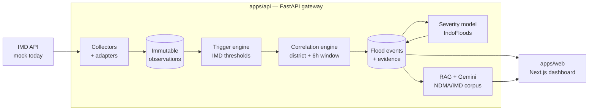

# 🌊 FloodGuard

> **AI-Powered Flood Intelligence Platform**

FloodGuard ingests meteorological data, detects flood triggers against IMD's published
thresholds, correlates them into evolving flood events, scores severity with a model
trained on real gauged floods, and answers preparedness questions from official NDMA
and IMD publications — with citations.

- **Run it:** `python run.py` → http://localhost:3000 · see **[RUNNING.md](RUNNING.md)**
- **[docs/folder_structure.md](docs/folder_structure.md)** — how the repo is laid out
- **[docs/project_status.md](docs/project_status.md)** — what is built and what is not

---

## Architecture

The web app has exactly one upstream — the gateway. It never calls IMD directly.

---

## What each piece does

| Layer | Behaviour |
|---|---|
| **Live weather** | **OpenWeather** is the first genuinely live source — observed conditions and a 5-day forecast for all 7 districts, refreshed each cycle. Observed rain and next-24h forecast accumulation both feed the trigger engine. IMD remains mocked, and the UI marks live figures `LIVE` so the two are never confused. |
| **Realtime** | The API publishes a server-sent event when a collection cycle completes, so dashboards update the moment new data lands instead of waiting out a poll. A 60s poll remains as a fallback; the header shows whether the stream is connected. |
| **Adapters** | Normalise every IMD response shape into one observation record. Raw JSON is never discarded; a content hash stops re-polls creating duplicates. |
| **Trigger engine** | Fires on IMD colour codes ≥ Orange and the official rainfall classes (64.5 / 115.6 / 204.5 mm). |
| **Correlation engine** | Matches a trigger to an open event in the same district within 6 hours, attaching it as evidence and raising confidence — otherwise opens a new event. Repeated evidence of the same *type* has diminishing returns, so one basin forecast split across four sub-basins counts once. |
| **Severity model** | `HistGradientBoosting` on IndoFloods — 4,548 real gauged events, 155 catchments. **ROC-AUC 0.575** under GroupKFold by gauge (unseen catchments). Modest but real; it contributes 25% of the blended risk score, the rule-based index drives the rest. |
| **RAG** | 2,677 chunks from 8 NDMA/IMD/NDRF PDFs in Chroma. **Hybrid retrieval** — vector search plus a keyword pass, then near-duplicate and per-document diversity filters. Pure vector search buried the answer under boilerplate footers reprinted on every page. Gemini answers are grounded and cited; with no key, source passages are returned verbatim and labelled as such. |

### On the ML honestly

The repo ships `services/ml/training/train_flood_risk.py`, which trains on
`flood_risk_india.csv` and reaches **ROC-AUC 0.496** — chance — with near-uniform
feature importances. That dataset's labels are unrelated to its features. The script is
kept as the record of why it was rejected, not because it is used.

Live scoring also has to interpolate rainfall accumulations from IMD's daily/weekly
totals, so `/predictions` labels every feature `observed`, `interpolated` or `imputed`
rather than presenting them all as measurements.

---

## Status

Working end to end: mock IMD → correlated events → ML score → AI summary → dashboard,
with a 60s scheduler.

Not built yet: CWC water levels, RSS/news ingestion, PostgreSQL + pgvector, auth,
Leaflet maps, notifications. River level and reservoir figures in the UI are labelled
proxies derived from rainfall until CWC is wired.
