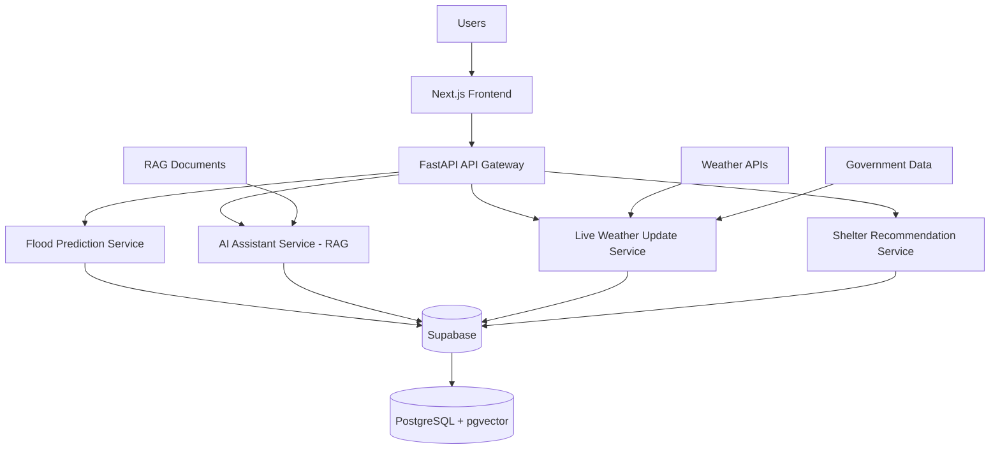

# 🌊 FloodGuard

> **An AI-Powered Real-Time Flood Response and Alert System**

FloodGuard is an AI-powered disaster management platform that predicts flood risk using Machine Learning, provides real-time weather updates, recommends nearby shelters, and assists users through a Retrieval-Augmented Generation (RAG) based AI assistant built on trusted government guidelines.

---

## 🏗️ System Architecture



---

## 📂 Project Structure

```text
FloodGuard/
│
├── backend/                   # FastAPI API Gateway and microservices
│
├── frontend/                  # Next.js + TypeScript + Tailwind CSS app
│
├── ml/                        # Machine Learning pipeline
│   ├── notebooks/
│   ├── preprocessing/
│   ├── training/
│   └── models/
│
├── datasets/
│   ├── raw/
│   │   ├── ml/
│   │   └── rag/
│   └── processed/
│
├── docs/
│
├── deployment/
│
├── scripts/
│
├── README.md
│
└── docker-compose.yml
```

---

## 🚀 Current Status

- [x] Project planning
- [x] Dataset collection
- [x] RAG document collection
- [x] Repository setup
