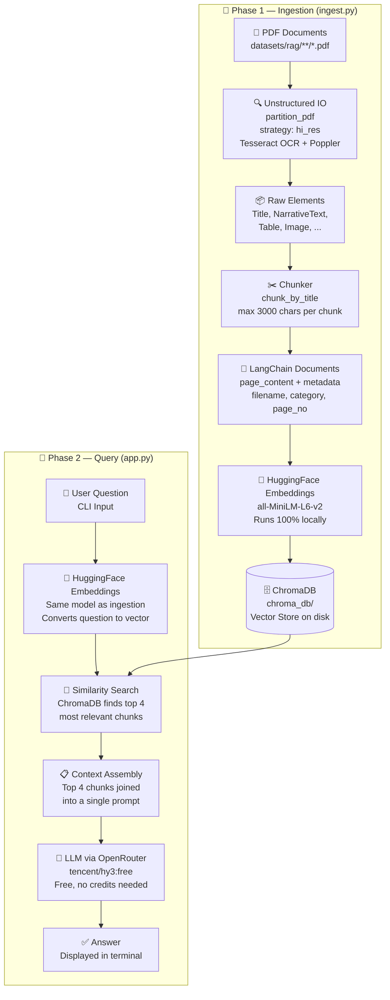

# FloodGuard RAG — Architecture

This document describes the architecture of the Retrieval-Augmented Generation (RAG) system built for FloodGuard. The system allows users to ask natural-language questions and receive answers grounded in the actual content of the official Flood Management PDF documents.

---

## Overview

The system is split into two distinct phases:

| Phase | Script | When it runs |
|---|---|---|
| **Ingestion** | `ingest.py` | Once, to process and store documents |
| **Query** | `app.py` | Every time the user wants to ask a question |

---

## Block Diagram



---

## Phase 1: Ingestion — `ingest.py`

This is the data preparation phase. It runs once and builds the searchable vector database from your raw PDF files.

### Step 1 — Document Partitioning

**Technology:** `unstructured` library with `partition_pdf`

The PDF is not just read as raw text. Instead, the `hi_res` strategy is used, which converts each page into an image and runs a full ML layout model (via `Tesseract-OCR` and `Poppler`) to:
- Detect the visual bounding box of each element (heading, paragraph, table, image)
- Classify what type each element is (`Title`, `NarrativeText`, `Table`, `Image`, etc.)
- Extract the raw text or HTML for each element

This is far superior to naive PDF text extraction, which completely loses the document structure.

```python
elements = partition_pdf(
    filename=file_path,
    strategy="hi_res",
    infer_table_structure=True,
    extract_image_block_types=["Image"],
)
```

### Step 2 — Chunking by Title

**Technology:** `unstructured.chunking.title.chunk_by_title`

The extracted elements are grouped into intelligent, semantically coherent chunks. This method groups all content under each heading (`Title` element) together, ensuring a chunk about "Urban Drainage Guidelines" contains only content from that section.

```python
chunks = chunk_by_title(
    elements,
    max_characters=3000,
    new_after_n_chars=2400,
    combine_text_under_n_chars=500
)
```

### Step 3 — LangChain Document Conversion

Each `unstructured` chunk is converted into a `langchain_core.documents.Document` object with two fields:
- **`page_content`**: The raw text of the chunk (used for embedding)
- **`metadata`**: A dictionary of useful attributes like `filename`, `page_number`, `chunk_category`, and `original_table_html`

This makes the data format compatible with ChromaDB and the LangChain retrieval ecosystem.

### Step 4 — Embedding Generation

**Technology:** `HuggingFaceEmbeddings` with `all-MiniLM-L6-v2`

Each chunk's `page_content` is converted into a **384-dimensional numerical vector** (an embedding) using a small, fast sentence transformer model that runs 100% locally on your CPU. No API calls are made in this step.

Embeddings capture **meaning**, not just keywords. Two sentences with the same meaning but different words will produce vectors that are very close together in space.

### Step 5 — Vector Storage

**Technology:** ChromaDB (local on-disk store)

All embeddings and their associated `page_content` + `metadata` are stored in a persistent ChromaDB database at `rag/chroma_db/`. This is a local folder and does not require a server or cloud connection.

---

## Phase 2: Query — `app.py`

This is the live interaction phase. It loads the pre-built database and uses it to answer user questions.

### Step 1 — User Question

The user types a question in the terminal. For example:
> "What is the role of NDMA in urban flood management?"

### Step 2 — Question Embedding

**Technology:** Same `HuggingFaceEmbeddings` model as ingestion

The user's question is converted into the exact same 384-dimensional vector space as the stored document chunks. This ensures they are directly comparable.

### Step 3 — Similarity Search

**Technology:** ChromaDB cosine similarity search

ChromaDB mathematically compares the question's vector against all stored document chunk vectors and returns the **top 4 most similar chunks**. This is the "retrieval" part of RAG.

```python
docs = db.similarity_search(query, k=4)
```

### Step 4 — Prompt Assembly

The 4 retrieved chunks are concatenated into a single context block and injected into a structured prompt:

```
You are an assistant for question-answering tasks.
Use the following pieces of retrieved context to answer the question.

Context:
[Chunk 1 text]
---
[Chunk 2 text]
---
...

Question: What is the role of NDMA?

Answer:
```

### Step 5 — LLM Generation

**Technology:** `ChatOpenAI` pointing to OpenRouter (`tencent/hy3:free`)

The assembled prompt is sent to the LLM via the OpenRouter API. The LLM reads the context and generates a grounded answer. Because the answer is generated from the retrieved document chunks, it is directly based on the actual policy documents — not the model's general knowledge.

---

## Key Design Decisions

| Decision | Rationale |
|---|---|
| `hi_res` OCR strategy | Many government PDFs are scanned images, not text-based. OCR ensures all content is extracted correctly. |
| `chunk_by_title` chunking | Preserves semantic coherence by keeping document sections together instead of splitting at arbitrary character limits. |
| Local HuggingFace embeddings | Completely free, no API rate limits during ingestion of large document sets. Works offline. |
| ChromaDB on-disk | Simple, zero-infrastructure vector store. No cloud setup or server required. |
| OpenRouter free LLM | Avoids paid OpenAI quota. Easily swappable by changing one line in `app.py`. |

---

## Technology Stack Summary

| Component | Technology |
|---|---|
| PDF Parsing | `unstructured` + Tesseract-OCR + Poppler |
| Chunking | `unstructured.chunking.title` |
| Embeddings | `HuggingFace` `all-MiniLM-L6-v2` (local) |
| Vector Store | `ChromaDB` (on-disk) |
| LLM | OpenRouter `tencent/hy3:free` (via `langchain-openai`) |
| Orchestration | Python CLI scripts (`ingest.py`, `app.py`) |
